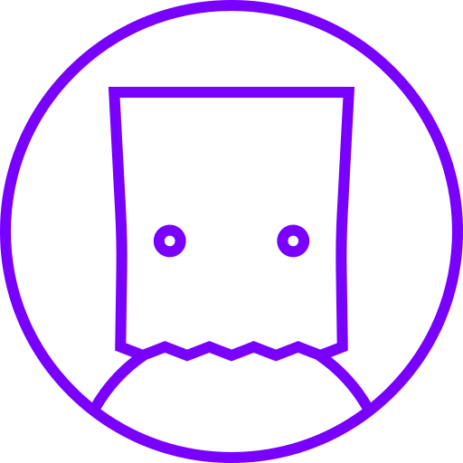

# AnCom - Anonymous Communication

<br>

<p align="center">
    
</p>

<br>

Ancom Client is a cross-platform desktop application for completely anonymous chat rooms. AnCom does not keep any logs, you can choose to use the releases, which are already connected to a server on the internet or set up your own [server](https://github.com/alexander-moscosa/ancom-server), if you really like privacy. (For the last configuration, go to `advanced manual installation`).

<br>

## How Does AnCom Work?

<br>

This application is completely made in Electron JS and the cornerstone of AnCom is the Socket.io library, which we use to establish the communication between the server and the client. The server is made in NodeJS, it receives events with which it handles information, such as sending a message to all the clients in a room. 

<br>

## Requirements

<br>

* Node >= v16.x
* npm >= v8.

<br>

## Basic Manual Installation (You can download the releases for your OS)

<br>

```
npm install
./node_modules/.bin/tsc
```

### Mac
```
npm run package-mac
```

### Windows
```
npm run package-win
```

### Linux
```
npm run package-linux
```

<br>

## Advanced Manual Installation (This is not in releases)

<br>

__IMPORTANT:__ To continue with the installation, you must have the [server](https://github.com/alexander-moscosa/ancom-server) configured and running on the internet or local.

<br>

1. Go to `./src/views/enter_room.html` and change the `src script` in line: `39` to your server URL. Ex. https://example.com/socket.io/socket.io.js

2. Go to `./src/views/js/enter_room.js` and change the variable `websocket_server` in line: `3` to your server URL. Ex. https://example.com

3. Go to `./src/views/js/create_room.js` and change the variable `websocket_server` in line: `3` to your server URL. Ex. https://example.com

<br>

```
npm install
./node_modules/.bin/tsc
```

### Mac
```
npm run package-mac
```

### Windows
```
npm run package-win
```

### Linux
```
npm run package-linux
```
